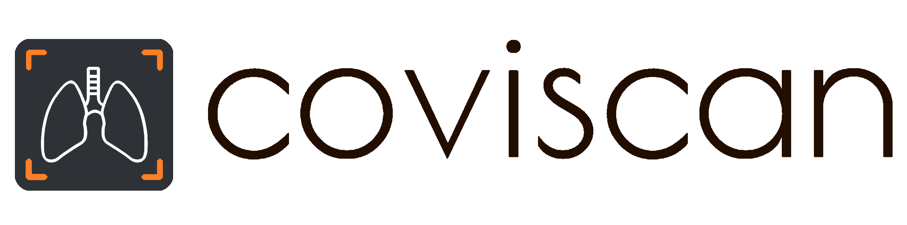

Coviscan is an automated imaging tool which process chest x-ray images and predicts whether the person has Covid-19 disease or Pneumonia or Normal.

It uses deep learning algorithm Convolution Neural Networks (CNNs) also known as ConvNets to process and extract features from X-Ray images. The whole pipeline involves several steps like preprocessing, semantic segmentation, classification etc.

# Datasets

- [https://www.kaggle.com/nikhilpandey360/chest-xray-masks-and-labels](https://www.kaggle.com/nikhilpandey360/chest-xray-masks-and-labels)
- [https://www.kaggle.com/tawsifurrahman/covid19-radiography-database](https://www.kaggle.com/tawsifurrahman/covid19-radiography-database)
- [https://www.kaggle.com/paultimothymooney/chest-xray-pneumonia](https://www.kaggle.com/paultimothymooney/chest-xray-pneumonia)
- [https://github.com/agchung/Figure1-COVID-chestxray-dataset](https://github.com/agchung/Figure1-COVID-chestxray-dataset)
- [https://github.com/ieee8023/covid-chestxray-dataset](https://github.com/ieee8023/covid-chestxray-dataset)

# Working


  ### Preprocessing
  Preprocessing includes resizing, converting to grayscale, normalization of xray image etc.
  
  ### Validation
  An xray validator (classifier) checks whether the image is an xray image or not.
  
  ### Lungs Segmentation
  Using **U-Net** architecture model, we segments out the lungs from the xray image. We used dice coefficient as loss function.
  This model was able to achieve a dice score of <code>**0.9621**</code> in training data and <code>**0.9611**</code> on test data. The model was trained for 46 epochs.
  
  ### Covid/Pneumonia/Normal Classification
  A CNN model predicts whether the patients have Covid or Pneumonia or Normal. We tested on three different CNN architectures (i.e., MobileNetV2, EfficientNetB2, DenseNet121) for this task. The **DenseNet121** gave the best result with the accuracy of <code>**95.67%**</code>. The accuracy of MobileNetV2 & EfficientNetB2 models was <code>92.64%</code> and <code>86.37%</code> respectively.

# How to use

- **Install Python**
  - Download and install python 3.9 from [python.org](https://www.python.org)


- **Get the code**
  ```
  git clone https://github.com/ayush9304/Covid19-Detector
  ```
 
- **Install Python dependencies**
    ```
    pip3 install -r requirements.txt
    ```
 
- **Run**
    ```
    py manage.py runserver
    ```
      
- **Explore**
  - Goto ```http://127.0.0.1:8000/``` url on any web browser

## License

Licensed under the MIT License.
